# 👠 WearAgain – Platforma do Sprzedaży i Zakupu Ubrań Online

WearAgain to aplikacja internetowa, która umożliwia łatwą i wygodną sprzedaż oraz zakup ubrań z drugiej ręki. Projekt wspiera ideę zrównoważonej mody i redukcji odpadów poprzez promowanie ponownego wykorzystania odzieży.

---

## ✨ Funkcjonalności aplikacji:
- 🔑 **Rejestracja i logowanie**: 
  Tworzenie konta, logowanie i edycja profilu użytkownika zrealizowane za pomocą pakietu Breeze.
- 🛍️ **Zarządzanie ogłoszeniami**: 
  Dodawanie, edytowanie oraz usuwanie ogłoszeń.
- 📦 **Zakupy i zamówienia**: 
  Intuicyjne składanie zamówień na produkty dostępne w serwisie.
- ⭐ **Oceny i komentarze**: 
  Wystawianie ocen i opinii po zakończeniu transakcji.
- 🔍 **Wyszukiwanie ofert**: 
  Rozbudowane opcje filtrowania (kategorie, ceny, rozmiar odzieży itp.).
- 👥 **Profile użytkowników**: 
  Przeglądanie profili użytkowników oraz ich opinii.
- 🌐 **Widoczność dla niezalogowanych**: 
  Możliwość przeglądania ofert bez logowania.
- ❤️ **Lista ulubionych**: 
  Dodawanie i usuwanie ogłoszeń z listy ulubionych.

---

## 🛠️ Technologie:
- **Laravel**: Framework PHP dla backendu (uwierzytelnianie, zarządzanie danymi).
- **MariaDB**: Wydajna baza danych przechowująca informacje o użytkownikach, ogłoszeniach i transakcjach.
- **Tailwind CSS**: Narzędzie do tworzenia nowoczesnego i responsywnego interfejsu użytkownika.

---

## 🖼️ Podgląd aplikacji

### 🌍 Ekran powitalny
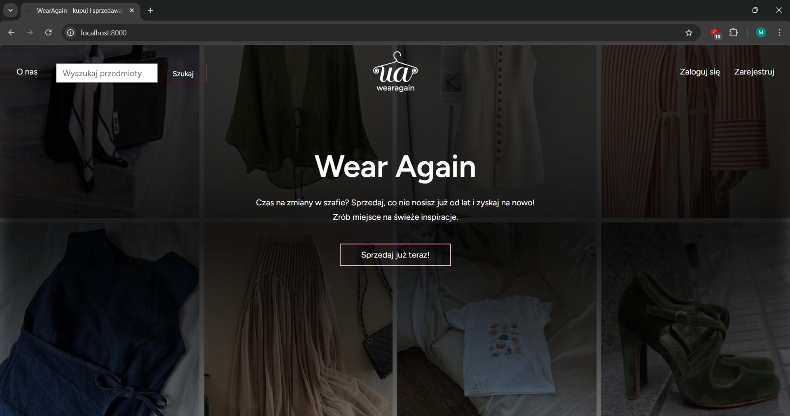

---

### 🔑 Rejestracja i logowanie
| Ekran logowania              | Ekran rejestracji          |
|------------------------------|----------------------------|
| 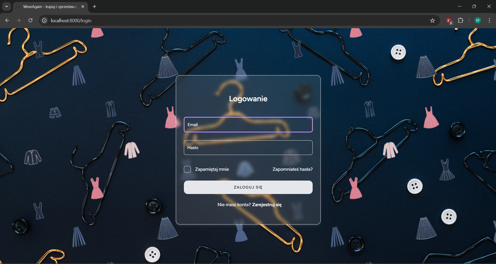 | 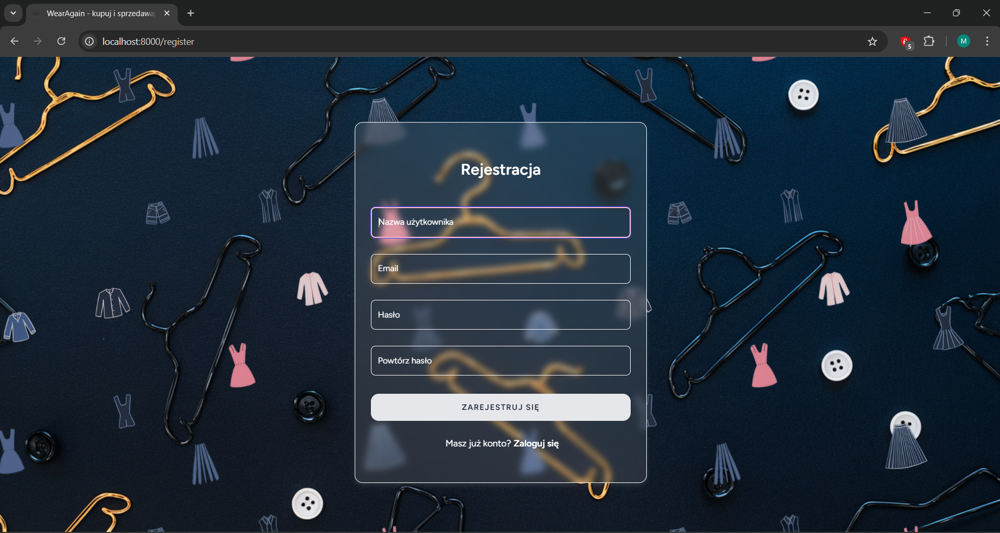 |

---

### 🌍 Ekran główny
| Kategorie                   | Wszystkie ogłoszenia       |
|-----------------------------|----------------------------|
| 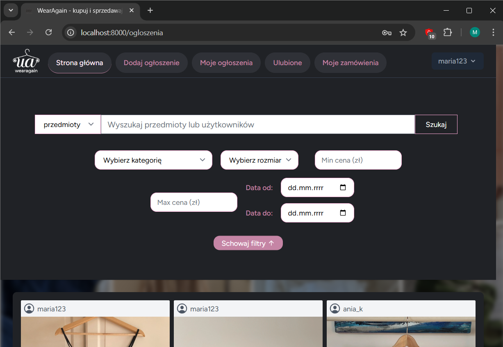 | 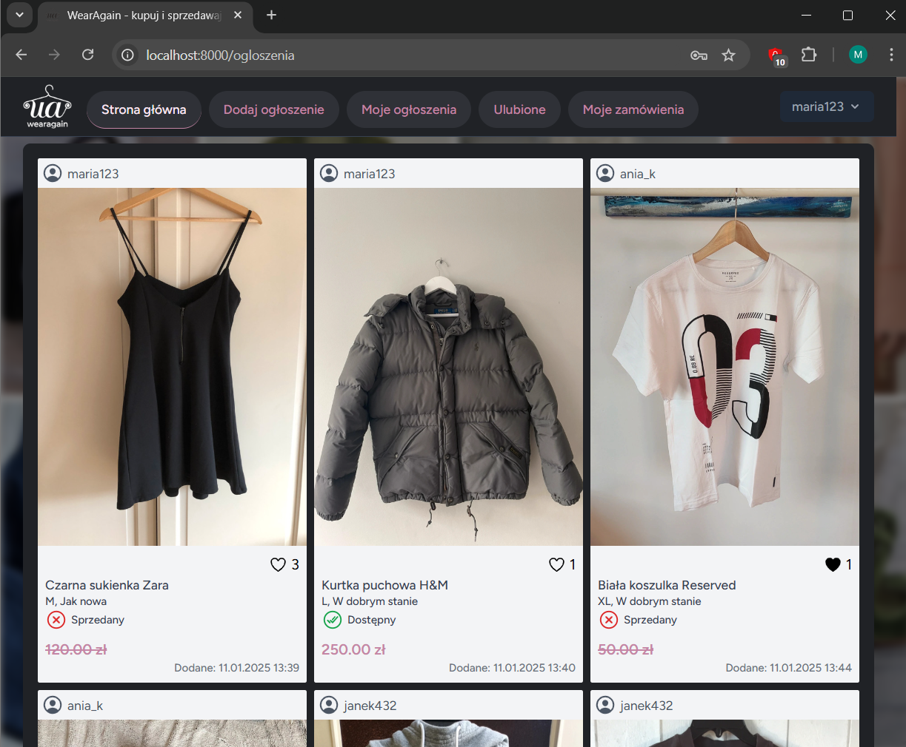 |

| Pojedyncze ogłoszenie      | Ogłoszenie nieaktualne     |
|----------------------------|----------------------------|
| 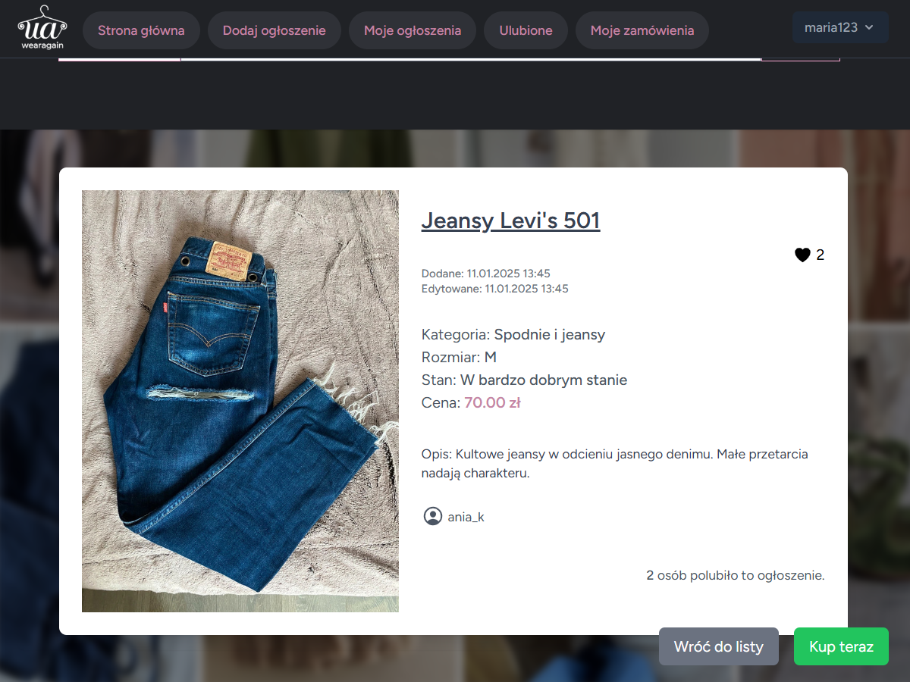 | 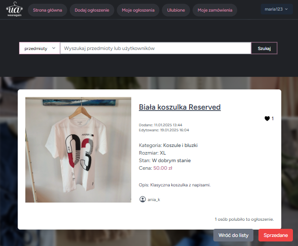 |

| Wyświetlanie użytkowników  | Profil użytkownika        |
|------------------------------|----------------------------|
| 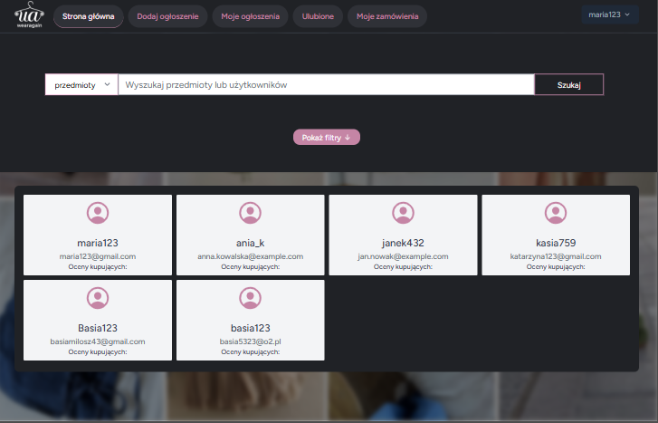 | 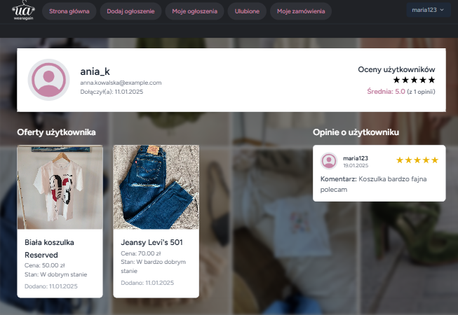 |

---

### 🛍️ Ogłoszenia
| Dodawanie ogłoszenia         | Edytowanie ogłoszenia      |
|------------------------------|----------------------------|
| 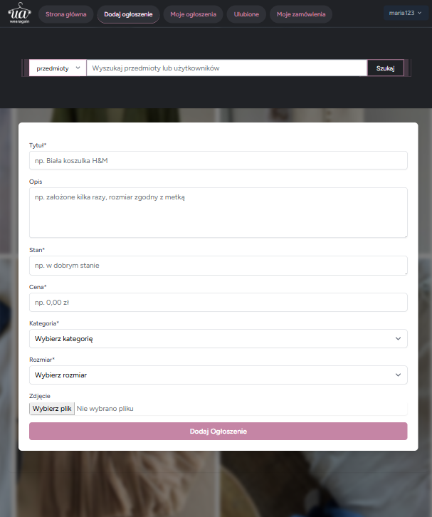 | 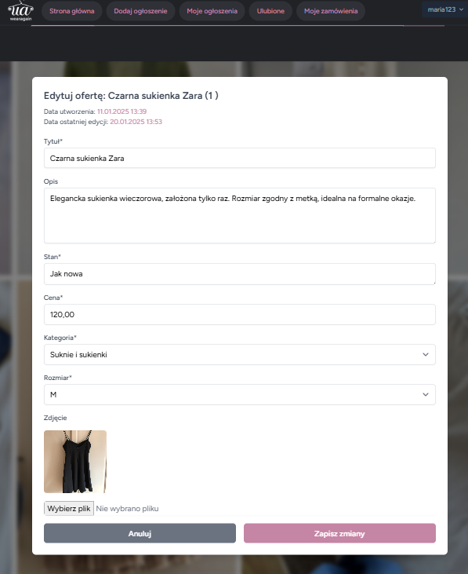 |

| Usuwanie ogłoszenia       | Usunięte ogłoszenia       |
|------------------------------|----------------------------|
| 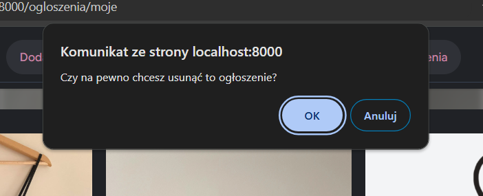 | 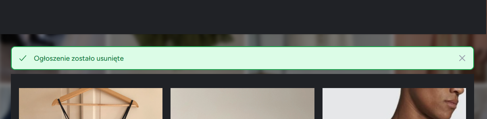 |

| Moje ogłoszenia            | Ulubione ogłoszenia        |
|----------------------------|----------------------------|
| 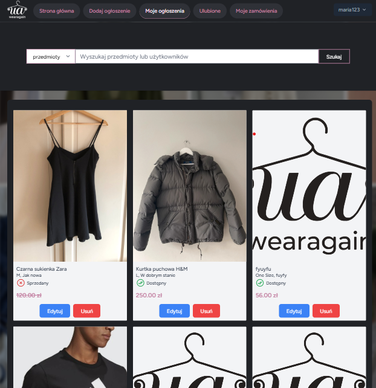 | 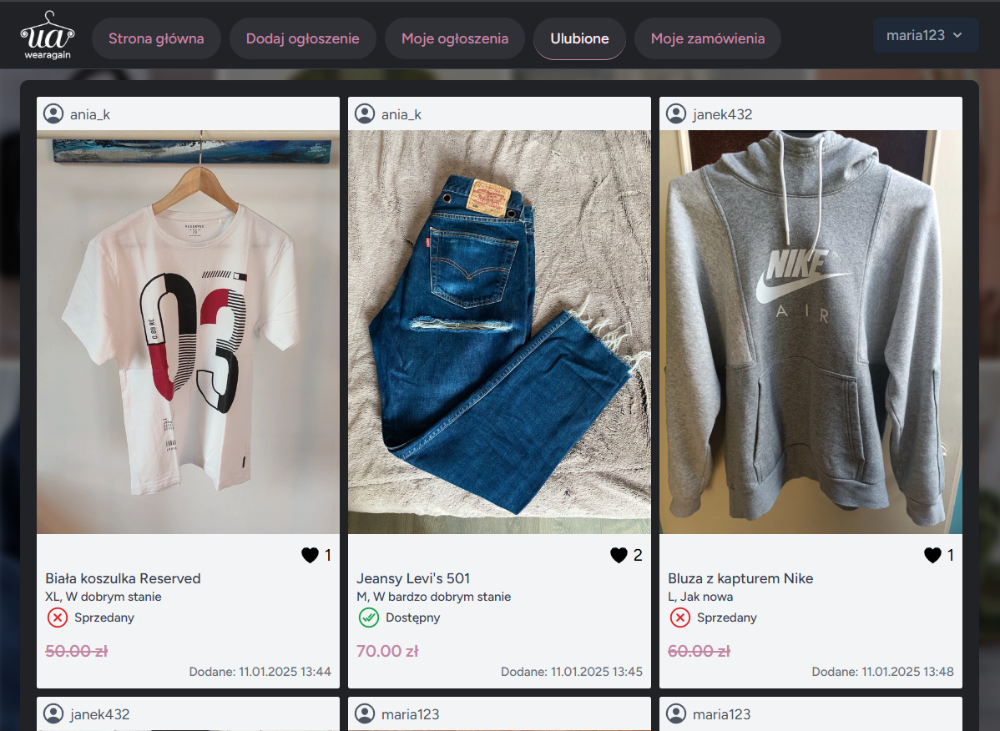 |

---

### 📦 Zamówienia
| Wyświetlanie zamówień        |
|---------------------------|
| 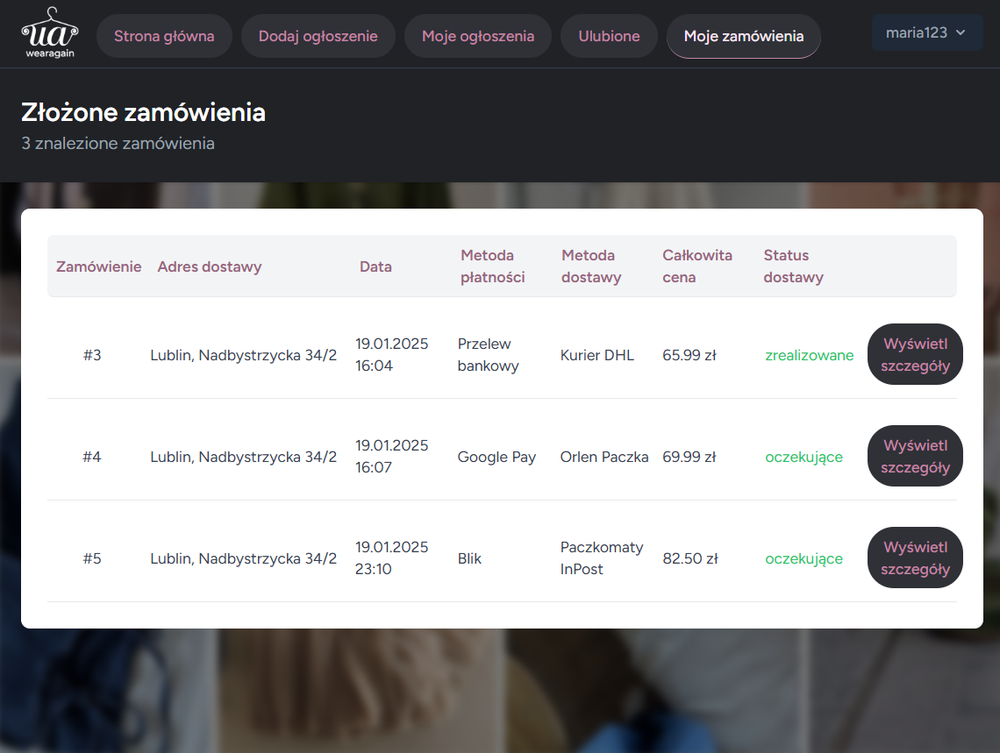 |

| Pojedyncze zamówienie      | Dodawanie opinii          |
|----------------------------|----------------------------|
| 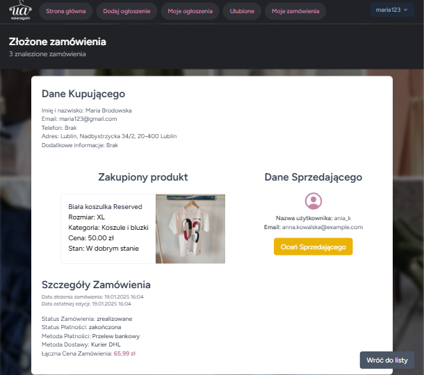 |  |

---

### 👤 Profil użytkownika
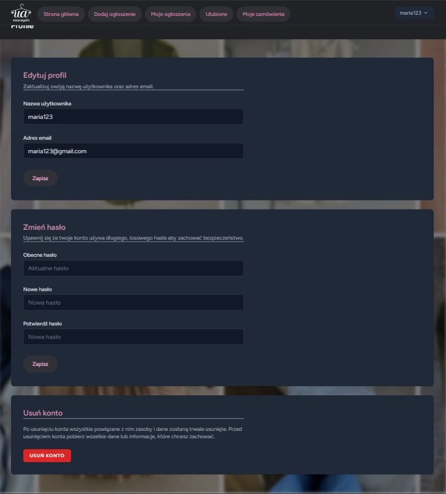

---
